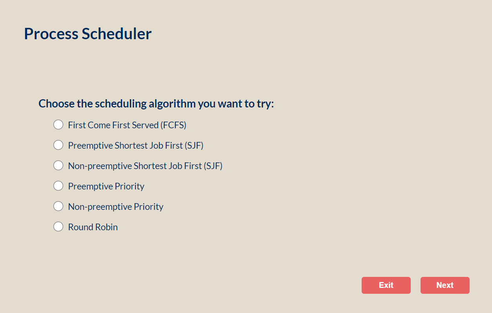
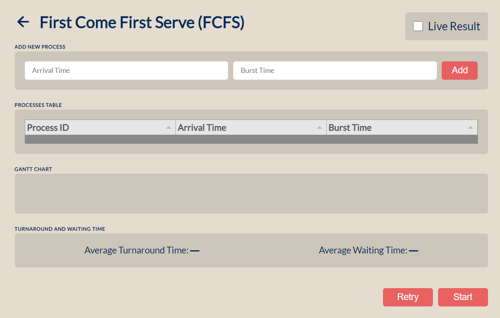
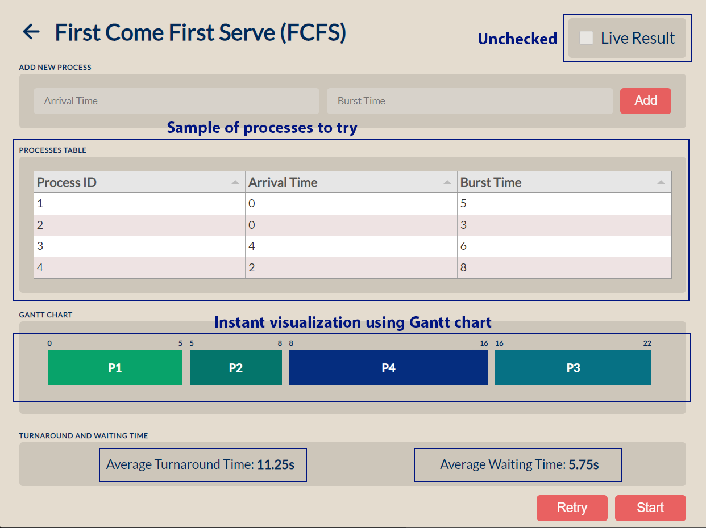
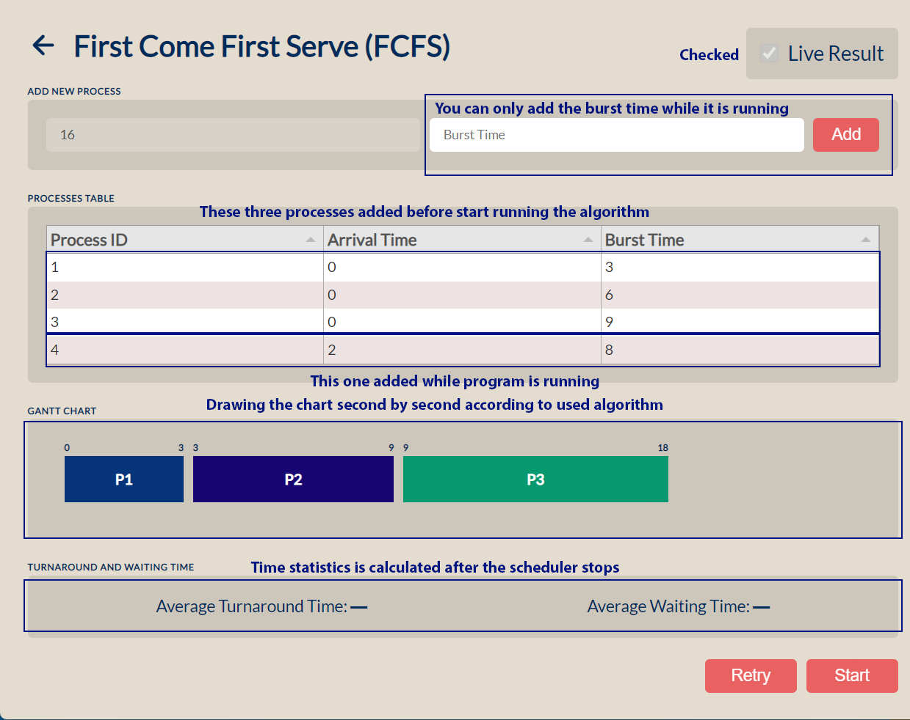
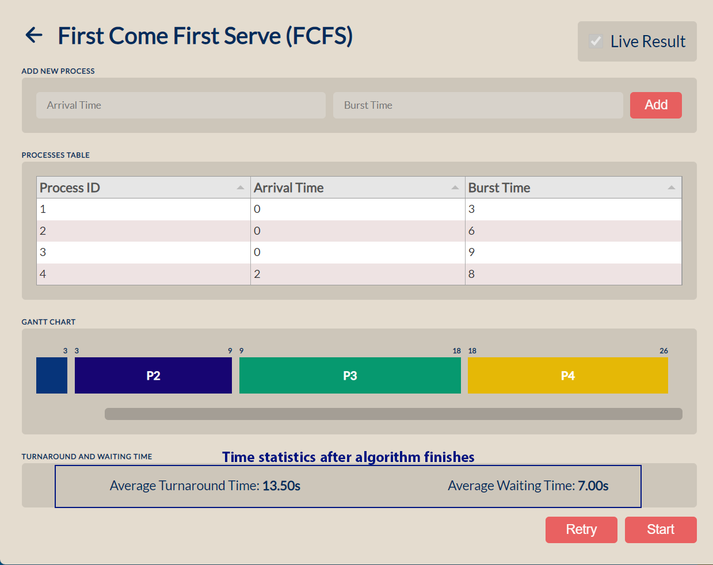

# Process scheduler
This program is based on Electron.

It's main function is to show how processes are being scheduled and their average and turnaround time on the CPU using many different scheduling algorithms which are:
* **[FCFS](https://www.educative.io/answers/first-come-first-served-fcfs-scheduling-algorithm)
 (First Come First Serve).**
* **[Non-Preemptive SJF](https://www.guru99.com/shortest-job-first-sjf-scheduling.html) (non-preemptive Shortest Job first).**
* **[Preemptive SJF](https://www.guru99.com/shortest-job-first-sjf-scheduling.html#:~:text=26/5%20%3D%205.2-,Preemptive%20SJF,-In%20Preemptive%20SJF) (preemptive Shortest Job first).**
* **[Non-Preemptive Priority Scheduling](https://www.educative.io/answers/what-is-a-non-preemptive-priority-scheduling-algorithm).**
* **[Preemptive Priority Scheduling](https://www.educative.io/answers/what-is-preemptive-priority-scheduling-algorithm).**
* **[Round Robin](https://www.guru99.com/round-robin-scheduling-example.html).**

All of those algorithms are used widely in many different systems.
___
## Describing The Interface
The interface of the program has a main page which you will see directly after opening it.

From this interface you should choose the option of the scheduler you want to visualize and press next to start some processes.

When next is pressed you will see the processes interface from which you will add any processes you want and their properties: arrival time, burst time, priority time(in priority scheduling only), also the quantum time in the round robin scheduling.

There is a check mark in the top right if this interface which is empty by default which will make you add as many processes as you want and only see the result of scheduling them after pressing start, i.e. no live addition can happen.

*example*: 

If the **Live Result** option was checked then you will have the ability to add some processes first and then start, after that when the program is running you will be able to add the processes dynamically while they're running. Also, you can't add the arrival time while it's running, you can only the burst time of the algorithm and it will be added with arrival time = the time it has been added.

All other Algorithms are working in the same way like those examples in images above with small changes:
*  priority schedulers have additional entry to add the priority.
*  round robin scheduler has additional field to add the quantum time.

**Caution:** Take care the program will terminate if it stayed 10 seconds without any process running on it (as timeout to save resources).
___
## Local Development Installation
1. Open your terminal
2. Clone the repo: git clone https://github.com/Ahmed-Khaled24/Process-Schedular
3. Enter the directory: cd Process-Schedular
4. Install the needed node packages: npm install
5. Open the application to see instant changes while you're working: npm start

___
## Contributors
| Name                 	| Email                     	|
|----------------------	|---------------------------	|
| Ahmed Khaled         	| ahmedkhaled.m24@gmail.com 	|
| Ahmed El Sayed       	| ahmedeltop968@gmail.com   	|
| Abd-El-Rahman Nasser 	| abdonasser865@gmail.com   	|
| Bassel Khaled        	| basselkhal@gmail.com      	|
| Omar Fahmy           	| ofahmy1234@gmail.com      	|
| Hanan Saeed          	| hanansaeedbs12@gmail.com  	|